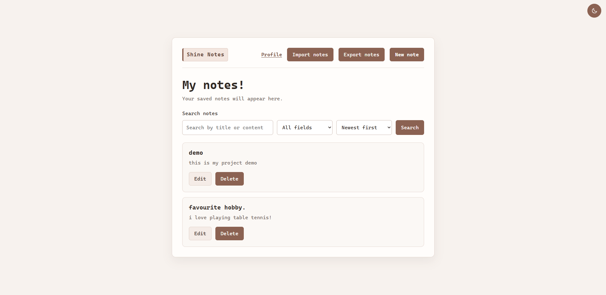
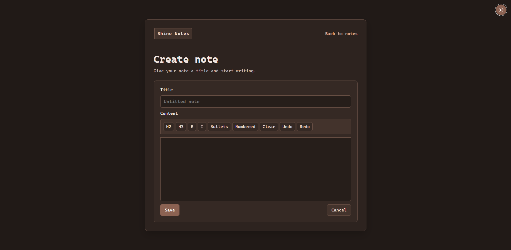

# Shine Notes

Shine Notes is a full-stack application for securely creating and managing
personal notes. It was developed as part of the 10Pearls Shine MERN internship,
using PostgreSQL as the approved database option.

## Project details

- **Developer:** Muhammad Umer Malik
- **Language:** TypeScript
- **Frontend:** React, React Router, Tiptap, Vite
- **Backend:** Node.js, Express, Pino, Zod
- **Database:** PostgreSQL with Prisma as the approved setup
- **Local environment:** Docker Desktop and Docker Compose
- **Testing:** Mocha/Chai and Jest
- **Code quality:** ESLint, Prettier, GitHub Actions, and SonarQube

## Features

- Registration, login, logout, and protected pages
- User-specific note creation, editing, and deletion
- Rich-text note editing
- Search, filtering, and sorting
- JSON export and JSON or text import
- User profile and dark mode
- Structured logging and global API error handling
- Backend and frontend automated tests

## Implementation highlights

- HTTP-only cookie-based authentication
- User-specific authorization for every note operation
- Prisma migrations for the PostgreSQL schema
- Pino HTTP and error logging
- Automated backend and frontend test coverage
- Local SonarQube analysis with documented results

## Application screenshots

### Notes dashboard

### Rich-text editor in dark mode

## Quality result

The local SonarQube quality gate passed with 90.5% coverage and no security or
reliability issues.

## Documentation

- [How to run the project](docs/how-to-run.md)
- [SonarQube report](docs/sonarqube-report.md)
