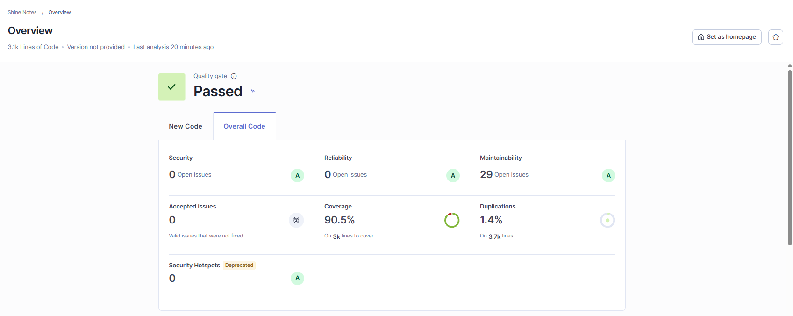

# SonarQube report

Shine Notes was analyzed locally using SonarQube Community
Build 26.8.0.126808.

## Results

| Measure           | Result            |
| ----------------- | ----------------- |
| Quality gate      | Passed            |
| Security          | A, 0 issues       |
| Reliability       | A, 0 issues       |
| Maintainability   | A, 29 suggestions |
| Security hotspots | 0                 |
| Coverage          | 90.5%             |
| Line coverage     | 92.6%             |
| Duplications      | 1.4%              |
| Lines of code     | 3,134             |



The remaining findings are 23 low-severity and six medium-severity
maintainability suggestions. Detailed screenshots are available in the
[SonarQube evidence folder](sonarqube-images/).

## Generate the report

1. Generate the backend and frontend LCOV coverage files:

   ```bash
   npm run test:coverage
   ```

2. Start SonarQube Community Build:

   ```bash
   docker run -d --name shine-notes-sonarqube -p 127.0.0.1:9000:9000 -e SONAR_ES_BOOTSTRAP_CHECKS_DISABLE=true sonarqube:community
   ```

3. Open `http://localhost:9000`, create the `shine-notes` project, and generate
   a project analysis token. Set the token as `SONAR_TOKEN` only in the current
   terminal.

4. Run the scanner from the repository root:

   ```bash
   docker run --rm -e SONAR_HOST_URL=http://host.docker.internal:9000 -e SONAR_TOKEN -v "${PWD}:/usr/src" sonarsource/sonar-scanner-cli
   ```

The scanner reads `sonar-project.properties`, imports both LCOV files, and sends
the results to the local dashboard. The token and generated `coverage` and
`.scannerwork` folders must not be committed.
